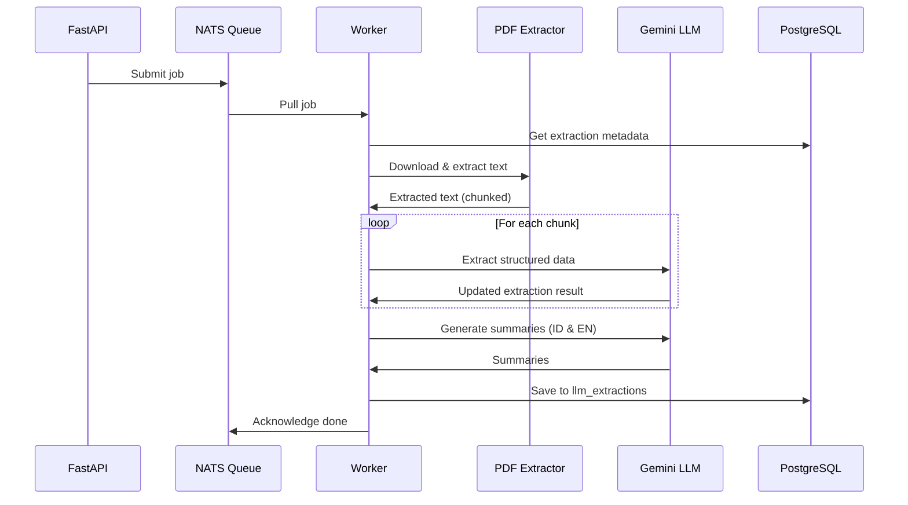

# Indonesia Supreme Court AI Extraction

Backend service for extracting structured data from Indonesian Supreme Court (Mahkamah Agung) decision documents using LLM.

## Features

- PDF text extraction (pdfminer, unstructured, OCR fallback)
- Chunked LLM processing for large documents (100 pages per chunk)
- Structured data extraction (50+ fields)
- Bilingual summaries (Indonesian & English)
- Async processing via NATS queue
- RESTful API with FastAPI

## Architecture

```
┌─────────────┐     ┌─────────────┐     ┌─────────────┐
│   FastAPI   │────▶│    NATS     │────▶│   Worker    │
│   Server    │     │   Queue     │     │  Consumer   │
└─────────────┘     └─────────────┘     └─────────────┘
       │                                       │
       │                                       ▼
       │                              ┌─────────────┐
       │                              │  Extraction │
       │                              │  Pipeline   │
       │                              └─────────────┘
       │                                       │
       ▼                                       ▼
┌─────────────┐                       ┌─────────────┐
│  PostgreSQL │◀──────────────────────│   Gemini    │
│  Database   │                       │   LLM API   │
└─────────────┘                       └─────────────┘
```

## Requirements

- Python 3.10+
- PostgreSQL
- NATS Server
- Gemini API Key (from [Google AI Studio](https://aistudio.google.com/apikey))
- System dependencies: `poppler-utils`, `tesseract-ocr`, `tesseract-ocr-ind`

## Setup

### 1. Environment Variables

```bash
cp .env.example .env
```

Edit `.env`:

```env
# Gemini API Key (from https://aistudio.google.com/apikey)
GEMINI_API_KEY=your_gemini_api_key

# Database
DB_ADDR=localhost:5432
DB_USER=postgres
DB_PASS=your_password

# NATS
NATS__URL=nats://localhost:4222

# Service
SERVICE_PORT=8004

# Optional: Google Cloud Storage
GCP_PROJECT_ID=
GCP_CREDENTIALS_BASE64=
```

### 2. Database Setup

Create the `llm_extractions` table:

```sql
CREATE TABLE llm_extractions (
    id VARCHAR(36) PRIMARY KEY DEFAULT gen_random_uuid()::varchar,
    extraction_id VARCHAR NOT NULL,
    extraction_result JSONB,
    summary_en TEXT,
    summary_id TEXT,
    status VARCHAR(50) NOT NULL DEFAULT 'pending',
    created_at TIMESTAMPTZ NOT NULL DEFAULT CURRENT_TIMESTAMP,
    updated_at TIMESTAMPTZ NOT NULL DEFAULT CURRENT_TIMESTAMP,

    CONSTRAINT fk_llm_extractions_extraction_id
        FOREIGN KEY (extraction_id) REFERENCES extractions(id)
);

CREATE INDEX idx_llm_extractions_extraction_id ON llm_extractions(extraction_id);
CREATE INDEX idx_llm_extractions_status ON llm_extractions(status);
```

### 3. Install Dependencies

```bash
# Using uv (recommended)
uv sync

# Or using pip
pip install -e .
```

### 4. Run the Service

```bash
# Development
uv run uvicorn main:app --port 8004 --reload

# Production
uv run uvicorn main:app --port 8004 --host 0.0.0.0
```

## API Reference

Base URL: `http://localhost:8004`

Interactive docs: `http://localhost:8004/docs`

### Endpoints

| Method | Endpoint | Description |
|--------|----------|-------------|
| `GET` | `/health` | Health check (NATS & DB status) |
| `POST` | `/extractions` | Submit extraction job to NATS queue |
| `GET` | `/extractions` | List all extractions |
| `GET` | `/extractions/{id}` | Get extraction result |
| `GET` | `/extractions/{id}/status` | Get extraction status |
| `DELETE` | `/extractions/{id}` | Delete extraction |
| `POST` | `/extractions/batch` | Submit all pending extractions to queue |
| `GET` | `/extractions/pending/count` | Get count of pending extractions |

### Health Check

```bash
curl http://localhost:8004/health
```

```json
{
  "status": "healthy",
  "nats_connected": true,
  "database_connected": true
}
```

### Run Extraction (Synchronous)

Blocks until extraction is complete. Use for small documents or testing.

```bash
curl -X POST http://localhost:8004/extractions \
  -H "Content-Type: application/json" \
  -d '{"extraction_id": "your-extraction-id"}'
```

### Run Extraction (Async)

Returns immediately, runs in background.

```bash
curl -X POST http://localhost:8004/extractions/async \
  -H "Content-Type: application/json" \
  -d '{"extraction_id": "your-extraction-id"}'
```

### Submit to NATS Queue

For distributed processing with multiple workers.

```bash
curl -X POST http://localhost:8004/extractions/queue \
  -H "Content-Type: application/json" \
  -d '{"extraction_id": "your-extraction-id"}'
```

### Check Status

```bash
curl http://localhost:8004/extractions/your-extraction-id/status
```

Status values: `pending`, `processing`, `completed`, `failed`

### Get Result

```bash
curl http://localhost:8004/extractions/your-extraction-id
```

### List Extractions

```bash
curl "http://localhost:8004/extractions?status=completed&limit=20&offset=0"
```

## CLI Usage

```bash
uv run python cli.py <extraction_id>
```

## Docker

### Using Docker Compose (Recommended)

```bash
# Start all services (API + NATS)
docker compose up -d

# View logs
docker compose logs -f extraction-api

# Stop services
docker compose down
```

### Manual Docker Build

```bash
# Build
docker build -t court-extraction-api --build-arg SERVICE_PORT=8004 .

# Run (requires external NATS and PostgreSQL)
docker run -p 8004:8004 --env-file .env court-extraction-api
```

### Development Docker

```bash
# Build with dev Dockerfile (copies all files)
docker build -f dev.Dockerfile -t court-extraction-api:dev .
```

## Extraction Result Schema

The `extraction_result` JSON contains 50+ fields:

| Category | Fields |
|----------|--------|
| **Case Info** | `case_register_number`, `verdict_number`, `verdict_date`, `court_district`, `province` |
| **Defendant** | `defendant_name`, `place_of_birth`, `date_of_birth`, `age`, `gender`, `address`, `occupation`, `education` |
| **Legal Counsel** | `legal_counsel_names`, `legal_counsel_office_addresses` |
| **Indictment** | `indictment_chronology`, `crime_scene_location`, `crime_time`, `indicted_state_loss`, `cited_articles_list` |
| **Prosecution** | `prosecution_demand_date`, `demanded_prison_sentence`, `demanded_fine`, `demanded_restitution` |
| **Verdict** | `verdict_article`, `sentenced_imprisonment`, `sentenced_fine`, `sentenced_restitution`, `proven_state_loss` |
| **Court Personnel** | `judge_names`, `prosecutor_names`, `court_clerk_names` |
| **Other** | `legal_facts`, `aggravating_factors_list`, `ruling_contents` |

## Processing Pipeline



## Project Structure

```
.
├── main.py              # FastAPI application & endpoints
├── cli.py               # CLI for single extractions
├── contexts.py          # App context (DB, NATS connections)
├── settings.py          # Configuration management
├── nats_consumer.py     # NATS JetStream consumer
├── src/
│   ├── extraction.py    # LLM extraction logic & models
│   ├── pipeline.py      # Extraction pipeline orchestrator
│   ├── io.py            # PDF reading, DB operations
│   ├── module.py        # (legacy) Old summarization
│   └── summarization.py # (legacy) Old pipeline
├── docs/
│   └── llm_extractions_table.md
├── Dockerfile
├── entrypoint.sh
├── pyproject.toml
└── .env.example
```
